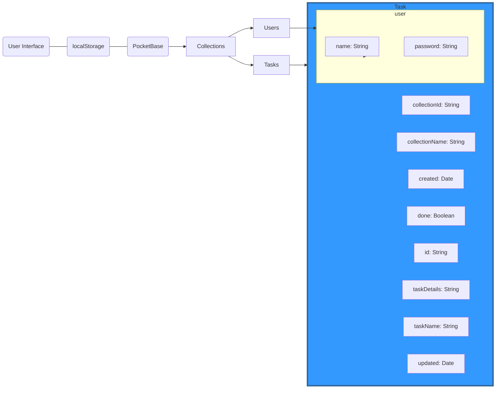

```mermaid
graph LR;
PB(PocketBase)
UI(User Interface)
LS(localStorage)
UI---LS---PB
Collections-->Users
Users-->user
user-->name
user-->password
Tasks-->Task 
    subgraph user
        name["name: String"]
        password["password: String"]
    end
    style Task fill:#39f,stroke:#369,stroke-width:4px
    subgraph Task
        collectionId["collectionId: String"]
        collectionName["collectionName: String"]
        created["created: Date"]
        done["done: Boolean"]
        id["id: String"]
        taskDetails["taskDetails: String"]
        taskName["taskName: String"]
        updated["updated: Date"]
        user["user: String"]
    end

PB-->Collections
Collections-->Tasks
```