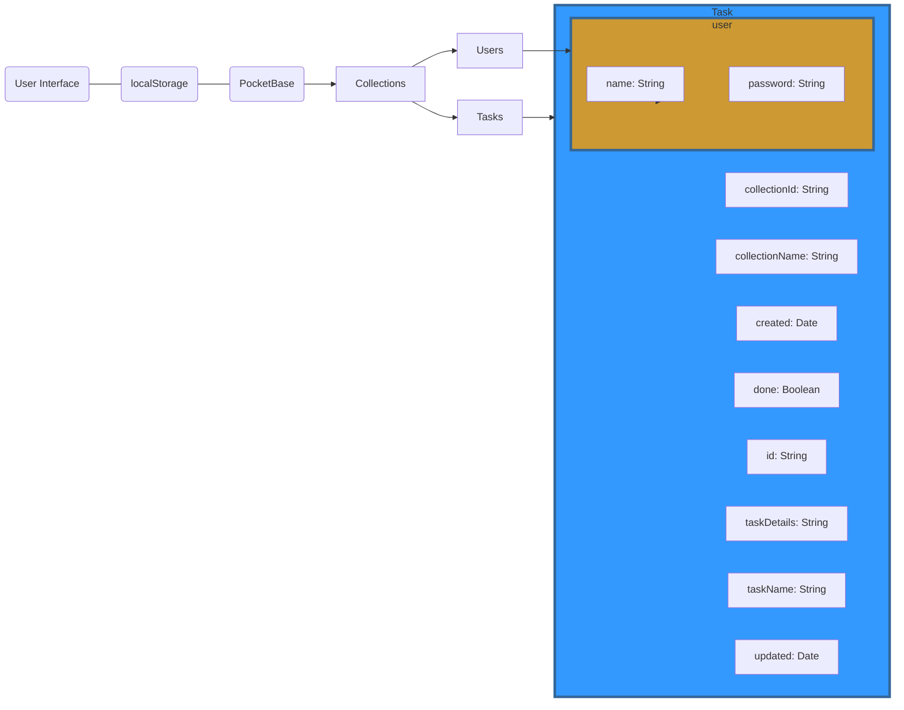
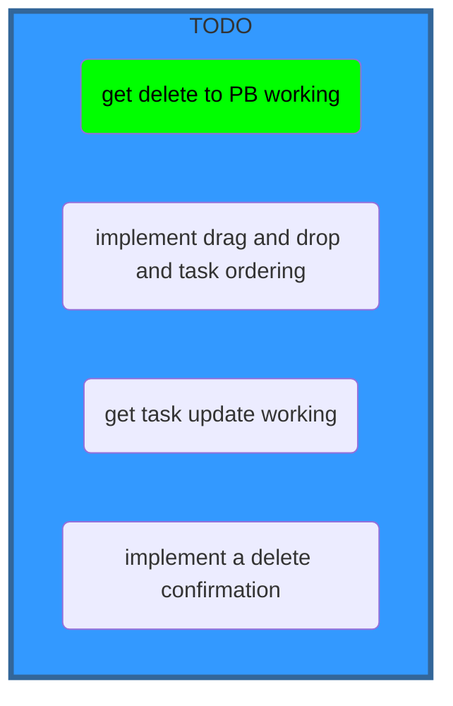

```mermaid
graph LR
PB(PocketBase)
UI(User Interface)
LS(localStorage)
UI---LS---PB
Collections-->Users
Users-->user
user-->name
user-->password
Tasks-->Task 
    subgraph user
        name["name: String"]
        password["password: String"]
    end
    style user fill:#c93,stroke:#369,stroke-width:4px


    style Task fill:#39f,stroke:#369,stroke-width:4px
    subgraph Task
        collectionId["collectionId: String"]
        collectionName["collectionName: String"]
        created["created: Date"]
        done["done: Boolean"]
        id["id: String"]
        taskDetails["taskDetails: String"]
        taskName["taskName: String"]
        updated["updated: Date"]
        user
    end

    
PB-->Collections
Collections-->Tasks

```

```mermaid
graph 
    style TODO fill:#39f,stroke:#369,stroke-width:4px
    subgraph TODO
        1("get delete to PB working")
        1b("implement a delete confirmation")
        2("implement drag and drop and task ordering")
        3("get task update working")
    end
    style 1 fill:#0f0,color:black

```